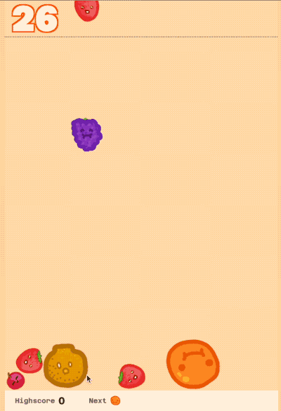

# Suika Reinforcement Learning Environment 🍉🍇🍊🍍🍌🍎🍐🫐🥝🥥
Suika is a popular Japanese puzzle game that combines the elements of Tetris and 2048. The game has gained significant popularity due to its unique and challenging gameplay mechanics.

This project provides the environmental interface for training reinforcement learning agents on Suika. 

## Environment Details
**Observation Space:** The observation space consists of the game state represented as an image of the game canvas and the current score.

**Action Space:** The action space is a single continuous value representing the position to drop the fruit.

**Rewards:** The agent is rewarded based on the score achieved in the game.

The environment uses Selenium to interface with Suika on the browser, providing a realistic and challenging environment for the agents. The environment self-hosts a local, open-source clone of Suika for improved debugging and hackability.

## Getting Started
To install the Suika Gymnasium Environment, follow these steps:

1. Clone the repository: `git clone https://github.com/your-repo/suika-gymnasium-env.git`
2. Navigate to the project directory: `cd suika-gymnasium-env`
4. Install the package: `pip install -e .`
5. Expose the package for python import. `export PYTHONPATH=/home/edward/projects/suika_rl`
6. To see how to use the env, run `python demo_async_vec_env.py`.

## Desired Improvements
- The environment transition takes about 0.5 seconds to complete. This makes data collection slow. To fix, we should speed up the animations and physics. 

## Acknowledgements

- [Original Suika Game](https://suikagame.com/)
- [Open Source Suika Version](https://github.com/TomboFry/suika-game)
- [CodeBullet's Suika Video](https://www.youtube.com/watch?v=QbwgQSwMSGM)
- GPT4 was used to accelerate development and documentation.

This project is inspired by the original Suika game and the open-source version. Special thanks to CodeBullet for the informative and entertaining video on Suika.